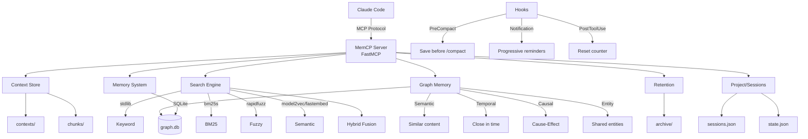
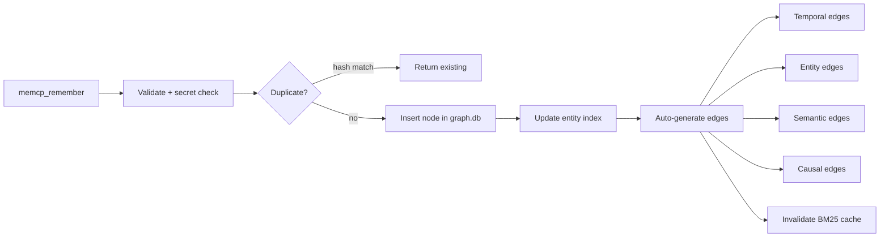
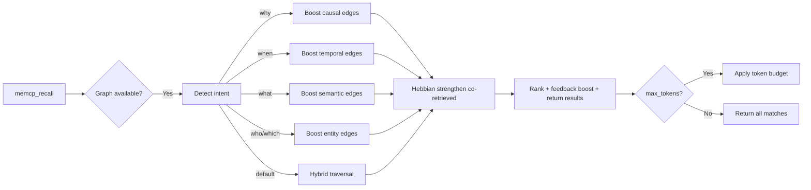
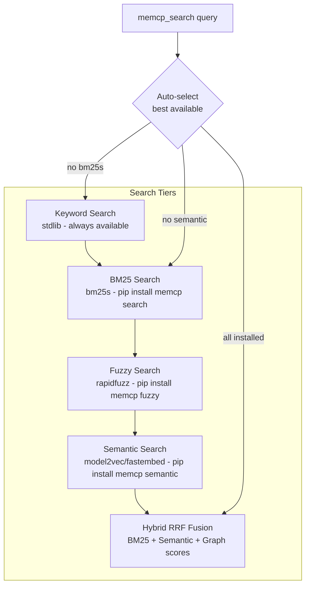
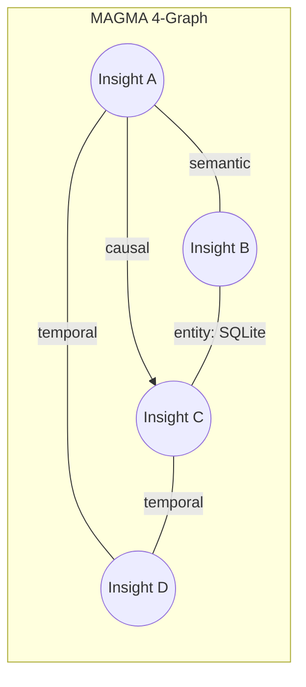
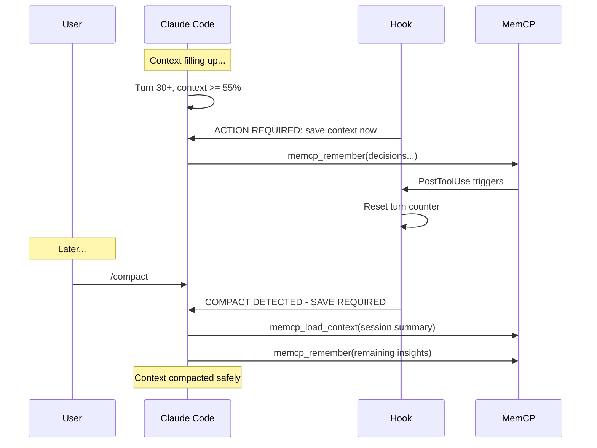
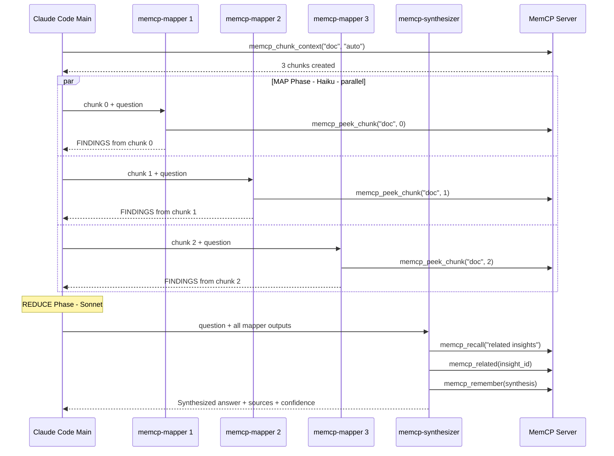

# MemCP Architecture

## System Overview

MemCP follows a 3-layer delegation pattern: `server.py` defines MCP tool endpoints, `tools/*.py` handles JSON serialization, and `core/*.py` contains the business logic.



## Data Flow: Remember

When Claude calls `memcp_remember()`, the insight flows through:



1. `server.py:memcp_remember()` parses parameters (async, runs in thread pool)
2. `core/memory.py:remember()` validates category/importance/content, runs secret detection (blocks API keys, tokens, credentials), generates an 8-char ID, checks for exact-hash duplicates (+ optional semantic dedup), computes `token_count` and `effective_importance`
3. `core/graph.py` facade delegates to `NodeStore.store()` (insert node + populate entity index) and `EdgeManager.generate_edges()` for 4 edge types:
   - **Temporal**: links to insights created within 30 minutes (same project)
   - **Entity**: links to insights sharing extracted entities (files, modules, URLs, CamelCase identifiers)
   - **Semantic**: links to top-3 most similar insights by keyword overlap (or cosine similarity if embeddings installed)
   - **Causal**: detects "because"/"therefore"/"due to" patterns and links to referenced insights

## Data Flow: Recall



Intent detection examines the query prefix:
- `"why..."` or `"reason"` or `"cause"` → emphasizes **causal** edges
- `"when..."` or `"timeline"` → emphasizes **temporal** edges
- `"who..."` or `"which..."` → emphasizes **entity** edges
- Default → emphasizes **semantic** edges

Ranking uses a weighted formula: `keyword_score * 0.7 + edge_boost * 0.3`, then adjusts by feedback score: `total_score *= (1 + feedback_score * 0.3)`. After ranking, Hebbian learning strengthens edges between co-retrieved results.

## Search Tier Stack



`search()` auto-selects: hybrid > bm25 > keyword. Each tier gracefully degrades if its dependencies aren't installed.

## MAGMA 4-Graph



All four edge types share the same node set (insights) and are stored in a single SQLite `edges` table with an `edge_type` column. Edges are bidirectional for semantic/temporal/entity and directional for causal (cause → effect).

## Auto-Save Hook Sequence



## RLM Map-Reduce Pipeline



## 3-Layer Delegation Pattern

```
server.py          # @mcp.tool() decorators — parameter parsing, JSON response (async via run_sync)
  ↓
tools/*.py         # Tool logic — orchestrate core calls, format JSON output
  ↓
core/*.py          # Business logic — returns plain dicts, no JSON serialization
  core/errors.py     # MemCPError hierarchy (5 exception types)
  core/secrets.py    # Secret detection (8 regex patterns)
  core/graph.py      # Thin facade → node_store.py + edge_manager.py + graph_traversal.py
  core/consolidation.py  # Similarity grouping + merge logic
  core/async_utils.py  # ThreadPoolExecutor for non-blocking I/O
```

| Layer | Example | Responsibility |
|-------|---------|----------------|
| `server.py` | `memcp_remember(content, category, ...)` | Define MCP tool, parse string params, call tool layer |
| `tools/retention_tools.py` | `do_retention_preview(archive_days, ...)` | Orchestrate core calls, format JSON response string |
| `core/retention.py` | `retention_preview(archive_days, ...)` | Pure logic, returns dict |

## Template Deployment

MemCP separates source templates from deployed configuration. The `templates/` directory contains the canonical versions of Claude Code configuration files. The installer (`scripts/install.sh`) deploys these to their target locations at install time.

```
hooks/snippets/
└── settings.json                   # Hook registration → merged into ~/.claude/settings.json

agents/                             # RLM sub-agent definitions → ~/.claude/agents/
├── memcp-analyzer.md               # Peek → identify → load → analyze (Haiku)
├── memcp-mapper.md                 # MAP phase (Haiku, parallel)
├── memcp-synthesizer.md            # REDUCE phase (Sonnet)
└── memcp-entity-extractor.md       # LLM entity extraction (Haiku)

templates/                          # Source (tracked in git)
└── CLAUDE.md                       # Session instructions → deployed to project root

~/.claude/                          # Deployed (user-level, global)
├── settings.json                   # ← hooks merged from hooks/snippets/settings.json
└── agents/                         # ← cp agents/memcp-*.md
    └── memcp-*.md

<project>/CLAUDE.md                 # ← cp templates/CLAUDE.md (project-level)
```

Sub-agent files use Claude Code frontmatter with:
- `tools` — comma-separated allowlist of MCP tools (e.g., `mcp__memcp__memcp_peek_chunk`)
- `mcpServers` — references the `memcp` MCP server
- `model` — Haiku for map/extract, Sonnet for synthesis
- `maxTurns` — limits agent execution length

## Data Directory Layout

```
~/.memcp/
  memory.json              # Phase 1 JSON backend (migrated to graph.db)
  graph.db                 # SQLite — MAGMA 4-graph (nodes + edges tables)
  state.json               # Turn counter, current project/session
  sessions.json            # Session registry
  contexts/                # Named context variables
    {name}/
      content.md           # Raw content
      meta.json            # Metadata (type, size, tokens, hash, access_count)
  chunks/                  # Chunked contexts
    {context_name}/
      index.json           # Chunk index (strategy, count, chunk metadata)
      0000.md              # Chunk files
      0001.md
      ...
  cache/                   # Embedding cache
    insight_embeddings.npz # Vectors for graph insights
  archive/                 # Retention archive
    contexts/              # Compressed archived contexts
      {name}/
        content.md.gz      # gzip-compressed content
        meta.json           # Original meta + archived_at
    insights.json          # Archived insights array
    purge_log.json         # Audit trail for purged items
```

## Configuration

All configuration is via environment variables (12-factor):

| Variable | Default | Description |
|----------|---------|-------------|
| `MEMCP_DATA_DIR` | `~/.memcp` | Data directory path |
| `MEMCP_MAX_MEMORY_MB` | `2048` | Max memory usage |
| `MEMCP_MAX_INSIGHTS` | `10000` | Max insight count before auto-pruning |
| `MEMCP_MAX_CONTEXT_SIZE_MB` | `10` | Max size per context |
| `MEMCP_IMPORTANCE_DECAY_DAYS` | `30` | Half-life for importance decay |
| `MEMCP_RETENTION_ARCHIVE_DAYS` | `30` | Days before archiving stale items |
| `MEMCP_RETENTION_PURGE_DAYS` | `180` | Days before purging archived items |
| `MEMCP_EMBEDDING_PROVIDER` | `auto` | `model2vec`, `fastembed`, or `auto` |
| `MEMCP_EMBEDDING_MODEL` | (default per provider) | Custom model name |
| `MEMCP_SEARCH_ALPHA` | `0.6` | Hybrid search weight (0=BM25 only, 1=semantic only) |
| `MEMCP_SECRET_DETECTION` | `true` | Enable/disable secret detection on `remember()` |
| `MEMCP_SEMANTIC_DEDUP` | `false` | Enable semantic deduplication (requires embeddings) |
| `MEMCP_DEDUP_THRESHOLD` | `0.95` | Cosine similarity threshold for semantic dedup |
| `MEMCP_HEBBIAN_ENABLED` | `true` | Enable/disable Hebbian co-retrieval strengthening |
| `MEMCP_HEBBIAN_BOOST` | `0.05` | Weight boost per co-retrieval event |
| `MEMCP_EDGE_DECAY_HALF_LIFE` | `30` | Half-life in days for edge weight decay |
| `MEMCP_EDGE_MIN_WEIGHT` | `0.05` | Minimum edge weight before pruning |
| `MEMCP_RRF_K` | `60` | RRF fusion smoothing constant |
| `MEMCP_CONSOLIDATION_THRESHOLD` | `0.85` | Similarity threshold for consolidation grouping |

## Technology Stack

| Component | Choice | Why |
|-----------|--------|-----|
| Framework | FastMCP | Standard `@mcp.tool()` decorator pattern |
| Storage | SQLite (graph) + Filesystem (contexts) | ACID graph + human-readable files |
| Data dir | `~/.memcp/` | Global, persists across projects |
| Config | Env vars via dataclass | 12-factor, works in local and Docker |
| Safety | Atomic writes + flock + secret detection + input validation | Crash-safe, concurrent-safe, credential-safe |
| Errors | MemCPError hierarchy (5 types) | Consistent error handling across all modules |
| Async | ThreadPoolExecutor + busy_timeout=5000 | Non-blocking MCP tool calls |
| Search | Tiered: keyword → BM25 (cached) → semantic (HNSW) → hybrid | Zero deps minimum, optional upgrades |

Core deps: `mcp>=1.0.0`, `pydantic>=2.0.0` (2 packages).

For detailed rationale behind each architectural decision, see the [Architecture Decision Records](adr/).
