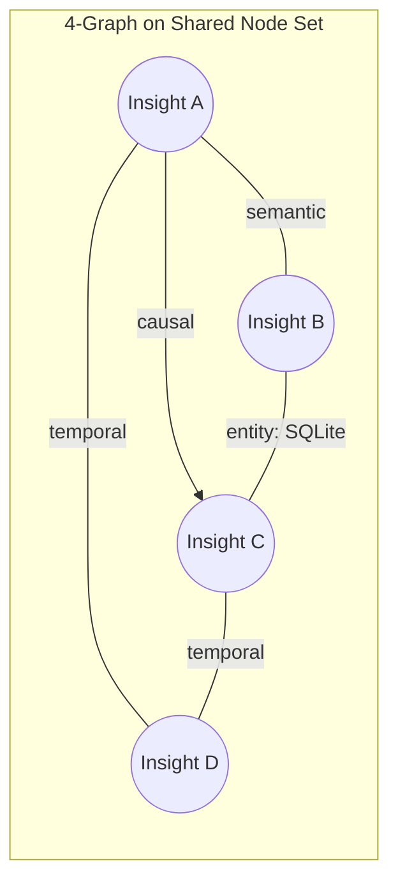

# MAGMA Graph Memory

MemCP implements a 4-graph memory architecture inspired by the MAGMA paper (arXiv:2601.03236). Instead of flat JSON insights, insights become graph nodes connected by four types of relationships that Claude can traverse.

## Architecture



All four edge types share the same node set (insights) and are stored in a single SQLite database (`~/.memcp/graph.db`) with WAL mode for concurrent reads and `busy_timeout=5000` for lock contention handling.

### Component Structure

The graph implementation is split into focused modules:

| Module | Class | Responsibility |
|--------|-------|----------------|
| `core/graph.py` | `GraphMemory` | Thin facade — delegates to components below |
| `core/node_store.py` | `NodeStore` | SQLite connection, schema, node CRUD, entity index |
| `core/edge_manager.py` | `EdgeManager` | All 4 edge generators, edge queries, Hebbian learning, edge decay |
| `core/graph_traversal.py` | `GraphTraversal` | Query routing, intent detection, ranking, BFS traversal |

## SQLite Schema

```sql
-- Nodes (insights)
CREATE TABLE nodes (
    id TEXT PRIMARY KEY,
    content TEXT NOT NULL,
    summary TEXT DEFAULT '',
    category TEXT DEFAULT 'general',
    importance TEXT DEFAULT 'medium',
    effective_importance REAL DEFAULT 0.5,
    tags TEXT DEFAULT '[]',          -- JSON array
    entities TEXT DEFAULT '[]',      -- JSON array
    project TEXT DEFAULT 'default',
    session TEXT DEFAULT '',
    token_count INTEGER DEFAULT 0,
    access_count INTEGER DEFAULT 0,
    feedback_score REAL DEFAULT 0.0, -- Reinforcement: [-1.0, 1.0]
    last_accessed_at TEXT,
    created_at TEXT NOT NULL
);

-- Edges (relationships)
CREATE TABLE edges (
    source_id TEXT NOT NULL,
    target_id TEXT NOT NULL,
    edge_type TEXT NOT NULL CHECK(edge_type IN ('semantic','temporal','causal','entity')),
    weight REAL DEFAULT 1.0,
    metadata TEXT DEFAULT '{}',      -- JSON object
    created_at TEXT NOT NULL,
    last_activated_at TEXT,          -- Hebbian: updated on co-retrieval
    PRIMARY KEY (source_id, target_id, edge_type),
    FOREIGN KEY (source_id) REFERENCES nodes(id) ON DELETE CASCADE,
    FOREIGN KEY (target_id) REFERENCES nodes(id) ON DELETE CASCADE
);
```

```sql
-- Inverted entity index (O(1) entity edge lookup)
CREATE TABLE entity_index (
    entity TEXT NOT NULL,
    node_id TEXT NOT NULL,
    PRIMARY KEY (entity, node_id),
    FOREIGN KEY (node_id) REFERENCES nodes(id) ON DELETE CASCADE
);
CREATE INDEX idx_entity_index_entity ON entity_index(entity);
```

Indexes on `edges(source_id)`, `edges(target_id)`, `edges(edge_type)`, `nodes(project)`, `nodes(category)`, `nodes(importance)`, `entity_index(entity)`.

## Edge Types

### Semantic Edges

Connect insights with similar content.

**Generation**: On insert, compares the new insight against all existing insights in the same project:
1. **With embeddings** (if `model2vec`/`fastembed` installed): Embeds the insight text + tags, computes cosine similarity against a `VectorStore`. Links to top-3 most similar with `score >= 0.3`.
2. **Without embeddings** (keyword fallback): Tokenizes content + tags, computes set overlap ratio: `len(overlap) / max(len(tokens_a), len(tokens_b))`. Links to top-3 with `score >= 0.1`.

**Weight**: The similarity score (0.0–1.0).

### Temporal Edges

Connect insights created close in time (within 30 minutes, same project).

**Generation**: On insert, finds the 20 most recent nodes in the same project. For each within 30 minutes, creates a temporal edge.

**Weight**: `max(0.1, 1.0 - delta_minutes / 30)` — closer in time = higher weight.

### Causal Edges

Connect cause → effect pairs, detected by keyword patterns.

**Generation**: Scans the new insight's content for causal language:
```
because, therefore, due to, caused by, as a result,
decided to, chosen because, so that, in order to,
leads to, results in
```

If found, examines the 10 most recent insights in the same project. Computes token overlap between the new insight and each candidate. If overlap of 3+ tokens with ratio >= 0.15, creates a directional edge (new insight → cause). Links to at most one cause.

**Weight**: The token overlap ratio.

### Entity Edges

Connect insights that mention the same entities.

**Generation**: On insert, extracts entities from the content via the entity extraction pipeline, populates the `entity_index` table, then uses the inverted index to find all other nodes sharing the same entities in O(matches) time (previously O(N*E) full table scan).

**Entity extraction** uses a pluggable extractor chain:

1. **`RegexEntityExtractor`** (always available) — fast pattern matching
2. **`SpacyEntityExtractor`** (optional, `pip install memcp[ner]`) — spaCy NER using `en_core_web_sm` for natural language entities (people, organizations, concepts)
3. **`CombinedEntityExtractor`** — merges results from both, deduplicates

When spaCy is installed, the combined extractor is used automatically. Otherwise, regex-only.

**Regex entity extraction patterns** (`RegexEntityExtractor`):

| Type | Pattern | Examples |
|------|---------|----------|
| File | `[.\w/-]+\.\w{1,10}` | `src/memcp/server.py`, `./config.json` |
| Module | `\w+(\.\w+){2,}` | `memcp.core.graph`, `os.path.join` |
| URL | `https?://[^\s"'<>)]+` | `https://github.com/...` |
| Mention | `@\w+` | `@claude`, `@user` |
| Identifier | `[A-Z][a-z]+([A-Z][a-z]+)+` | `GraphMemory`, `EntityExtractor` |

Entities shorter than 3 characters are ignored. Duplicates (case-insensitive) are deduplicated.

**Weight**: 1.0 (binary — either shares an entity or doesn't).

**Metadata**: `{"entity": "the shared entity name"}`.

## Intent-Aware Query Traversal

When `memcp_recall(query)` is called, the graph detects the query's intent and boosts the corresponding edge type:

| Query intent | Detection | Primary edge type |
|-------------|-----------|-------------------|
| **why** | Starts with "why", contains "reason" or "cause" | Causal |
| **when** | Starts with "when", contains "timeline" or "chronolog" | Temporal |
| **who/which** | Starts with "who"/"which", contains "entity" | Entity |
| **what** (default) | Everything else | Semantic |

### Ranking Formula

```
total_score = keyword_score * 0.7 + edge_boost * 0.3
total_score *= (1 + feedback_score * 0.3)  # Feedback reinforcement
```

- **keyword_score**: `len(query_tokens & doc_tokens) / len(query_tokens)` — fraction of query tokens found in the document
- **edge_boost**: Computed from the node's edge connectivity for the primary type:

```
edge_boost = min(1.0, primary_count / max(1, total_count) + 0.1 * primary_count)
```

Where `primary_count` = edges of the intent-relevant type, `total_count` = all edges.

- **feedback_score**: From `memcp_reinforce()` — ranges from -1.0 to 1.0. A fully helpful insight gets a 30% ranking boost; a fully misleading one gets a 30% penalty.

## Graph Traversal

`memcp_related(insight_id, edge_type, depth)` performs breadth-first traversal:

1. Start from the center node
2. For each depth level, find all edges connected to the current frontier
3. Follow edges to discover new nodes (avoiding revisits)
4. Optionally filter by edge type

Returns:
```json
{
    "center": { ... },
    "related": [ ... ],
    "edges": [ ... ],
    "depth": 1,
    "edge_type_filter": "all"
}
```

## Hebbian Co-Retrieval Strengthening

When insights are recalled together, MemCP strengthens the edges between them — implementing Hebb's rule ("neurons that fire together wire together").

**How it works**: After every `recall()` query, the top-10 result nodes have their shared edge weights boosted:

```
weight = min(weight + boost, 1.0)
```

- Default boost: `0.05` per co-retrieval (`MEMCP_HEBBIAN_BOOST`)
- `last_activated_at` timestamp is updated for decay tracking
- Controlled by `MEMCP_HEBBIAN_ENABLED` (default `true`)

This creates a self-organizing graph: frequently co-recalled knowledge becomes more tightly connected.

## Activation-Based Edge Decay

Edges that haven't been activated in recall gradually lose weight, keeping the graph clean:

```
weight_new = weight * 2^(-days_since_activation / half_life)
```

- Default half-life: 30 days (`MEMCP_EDGE_DECAY_HALF_LIFE`)
- Edges below `min_weight` (default 0.05, `MEMCP_EDGE_MIN_WEIGHT`) are pruned
- Rate-limited to once per hour to avoid performance overhead
- Called lazily during `query()` — no background scheduler needed

## Memory Feedback

The `memcp_reinforce` tool lets users mark insights as helpful or misleading:

- `helpful=True`: `feedback_score += 0.1`, boost connected edges by 0.02
- `helpful=False`: `feedback_score -= 0.2`, weaken connected edges by 0.05
- Score clamped to `[-1.0, 1.0]`

Feedback affects query ranking: `total_score *= (1 + feedback_score * 0.3)`.

## Migration from JSON

When MemCP first encounters `graph.db` not existing but `memory.json` present, it can migrate via `GraphMemory.migrate_from_json(memory)`. This re-inserts all insights as nodes and auto-generates edges.

## Entity Extraction Pipeline

The `EntityExtractor` base class supports pluggable implementations:

- **Regex** (always available): `RegexEntityExtractor` — fast, pattern-based (files, modules, URLs, CamelCase)
- **spaCy NER** (optional, `pip install memcp[ner]`): `SpacyEntityExtractor` — uses `en_core_web_sm` for natural language entities (people, organizations, technical concepts)
- **Combined** (auto-selected when spaCy available): `CombinedEntityExtractor` — merges regex + spaCy results, deduplicates
- **LLM-based** (sub-agents): `memcp-entity-extractor` sub-agent uses Claude's NLU for the richest extraction ("the auth system", "Mohamed's preference")

The sub-agent outputs entities that are then fed back via `memcp_remember(entities="entity1,entity2,...")`, which triggers `GraphMemory.store()` to auto-generate entity edges.

## Graph Statistics

`memcp_graph_stats(project)` returns:

```json
{
    "node_count": 42,
    "edge_counts": {
        "semantic": 120,
        "temporal": 85,
        "causal": 15,
        "entity": 67
    },
    "total_edges": 287,
    "top_entities": [
        {"entity": "graph.db", "count": 12},
        {"entity": "GraphMemory", "count": 8},
        ...
    ]
}
```
