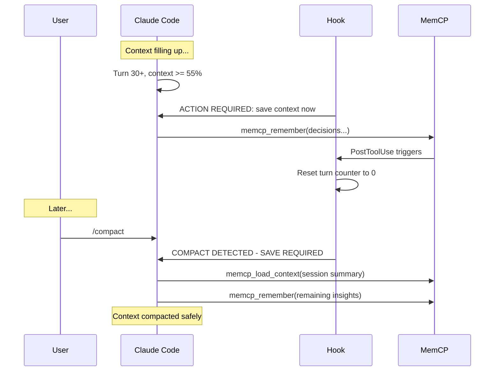

# Auto-Save Hooks

MemCP uses Claude Code hooks to ensure context is never lost, even during `/compact` or long sessions. Hooks run automatically — you don't need to trigger them.

## Hook Architecture



## Hook Files

### PreCompact: `hooks/pre_compact_save.py`

**Trigger**: Before any `/compact` (manual or auto-triggered).

**Behavior**: Reads hook input from stdin, outputs a **blocking** system message:

```
COMPACT DETECTED — SAVE REQUIRED

Before continuing, you MUST:
1. memcp_remember() — Save each decision, finding, or rule discovered in this session
2. memcp_load_context() — Save a summary of this session's key points as a named context

What isn't saved will be LOST after compact.
After saving, proceed with compact.
```

The `blockExecution: true` flag prevents compact from proceeding until Claude has saved context.

### Progressive Reminders: `hooks/auto_save_reminder.py`

**Trigger**: On every Notification event (fires periodically during Claude sessions).

**Behavior**: Tracks turn count in `~/.memcp/state.json`. Only triggers when both conditions are met: turn threshold AND context usage >= 55%.

| Turns | Context | Severity | Message |
|-------|---------|----------|---------|
| 10+ | >= 55% | Info | "Consider saving important context" |
| 20+ | >= 55% | Warning | "Recommended: save decisions and findings" |
| 30+ | >= 55% | Critical | "ACTION REQUIRED: save context now" |

If context usage is below 55%, no reminder is output regardless of turn count.

**Turn tracking**: The hook increments `state.json.turn_count` on every invocation. This counter is reset to 0 when a save operation occurs (see Reset Counter below).

### Reset Counter: `hooks/reset_counter.py`

**Trigger**: PostToolUse — after `memcp_remember` or `memcp_load_context` is called.

**Behavior**: Silently resets `~/.memcp/state.json.turn_count` to 0. This means:
- After saving, the progressive reminder cycle restarts
- You won't get nagged immediately after saving
- The next reminder won't come until 10+ more turns pass

## Hook Registration

Hooks are registered in `~/.claude/settings.json` (user-level), which makes them available across all your projects. Use the dedicated hook manager script:

```bash
# Install hooks (merge into ~/.claude/settings.json)
bash scripts/setup-hooks.sh install

# Remove hooks
bash scripts/setup-hooks.sh remove

# Check current hook status
bash scripts/setup-hooks.sh status

# Non-interactive install (e.g., in CI or from install.sh)
bash scripts/setup-hooks.sh install --quiet
```

The installer (`bash scripts/install.sh`, step 7) delegates to this script automatically. To deploy manually without the full installer, use `setup-hooks.sh install` directly.

The configuration:

```json
{
  "hooks": {
    "PreCompact": [
      {
        "matcher": "",
        "hooks": [
          {
            "type": "command",
            "command": "python3 hooks/pre_compact_save.py"
          }
        ]
      }
    ],
    "PostToolUse": [
      {
        "matcher": "mcp__memcp__memcp_remember",
        "hooks": [
          {
            "type": "command",
            "command": "python3 hooks/reset_counter.py"
          }
        ]
      },
      {
        "matcher": "mcp__memcp__memcp_load_context",
        "hooks": [
          {
            "type": "command",
            "command": "python3 hooks/reset_counter.py"
          }
        ]
      }
    ],
    "Notification": [
      {
        "matcher": "",
        "hooks": [
          {
            "type": "command",
            "command": "python3 hooks/auto_save_reminder.py"
          }
        ]
      }
    ]
  }
}
```

### Matcher Patterns

- `""` (empty) — matches all events of that type
- `"mcp__memcp__memcp_remember"` — matches only the specific tool call. Format: `mcp__{server}__{tool}`

## State File

The hooks use `~/.memcp/state.json` (or `$MEMCP_DATA_DIR/state.json`) to persist state:

```json
{
  "turn_count": 15,
  "current_project": "memcp",
  "current_session": "memcp_2026-02-06_001"
}
```

The `turn_count` field is managed by the hooks. The `current_project` and `current_session` fields are managed by the project/session system (Phase 7).

## Customization

### Changing Thresholds

The turn thresholds (10/20/30) and context percentage threshold (55%) are hardcoded in `auto_save_reminder.py`. To customize, edit the values directly:

```python
# In hooks/auto_save_reminder.py
if context_pct < 55:    # Change context threshold here
    ...
if turns >= 30:          # Change turn thresholds here
    ...
elif turns >= 20:
    ...
elif turns >= 10:
    ...
```

### Adding More Save Triggers

To reset the counter after additional tools, add more PostToolUse entries:

```json
{
  "matcher": "mcp__memcp__memcp_chunk_context",
  "hooks": [
    {
      "type": "command",
      "command": "python3 hooks/reset_counter.py"
    }
  ]
}
```

### Data Directory

All hooks respect the `MEMCP_DATA_DIR` environment variable. Default: `~/.memcp`.

## Manual Save Fallback

If hooks don't trigger (e.g., not registered, or running outside Claude Code), you can always save manually:

```
memcp_remember("Key decision: ...", category="decision", importance="high")
memcp_load_context("session-summary", content="Session key points: ...")
```

This is documented in `templates/CLAUDE.md` (deployed to project root by the installer) as a fallback.
